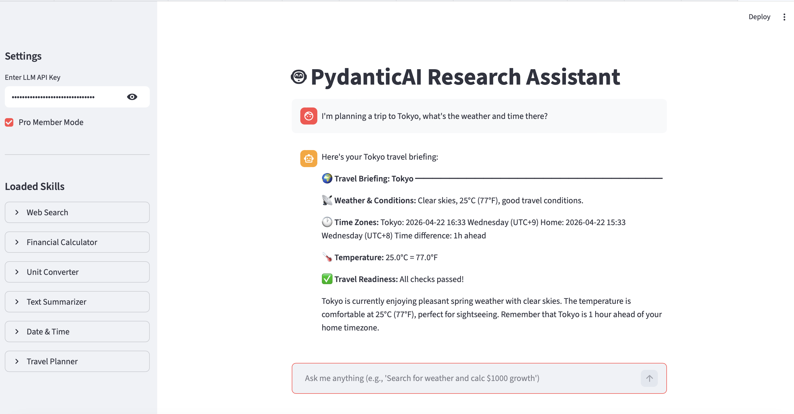

# Sample Agent

PydanticAI Research Assistant

## 示例截图



## 流程文档

[流程文档 (PDF)](doc/flow.pdf)

## Run on MacOS

```bash
brew install pyenv
poetry env use $(pyenv prefix 3.11)/bin/python
poetry lock
poetry install --no-root
poetry run streamlit run app.py
```

## 本地访问

启动后，在浏览器中打开以下地址访问应用：

```
http://localhost:8501
```